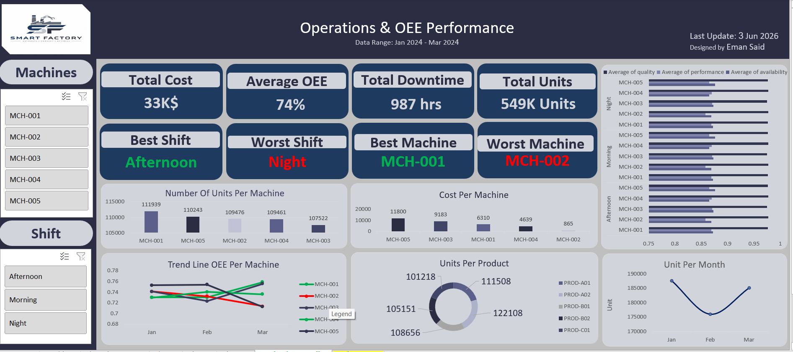
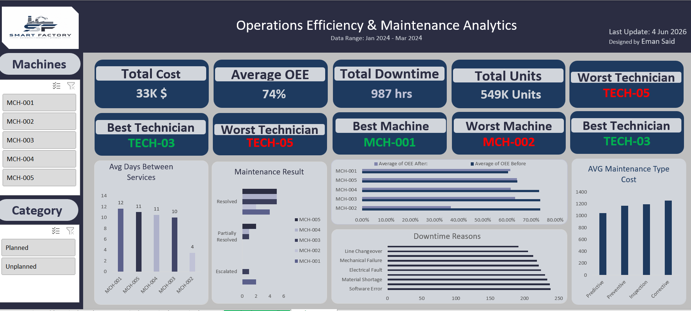

# Smart Factory: Operations Efficiency & Maintenance Analytics Dashboard

## 📌 Project Overview
This comprehensive Excel dashboard provides an end-to-end analysis of manufacturing operations, **Overall Equipment Effectiveness (OEE)**, and maintenance performance. By linking machine breakdowns, technician performance, and maintenance costs, this project identifies critical operational bottlenecks and delivers actionable insights to improve factory uptime and reduce costs.

* **Data Range:** Jan 2024 - Mar 2024
* **Designed By:** Eman Said
* **Industry Context:** Manufacturing / Industry 4.0 / Smart Factory

---

## 📊 Key Insights & Data Storytelling

### 1. Operational Efficiency & Trends
* **OEE Benchmark:** The factory operates at an **Average OEE of 74%**, which is close to solid manufacturing standards but shows potential for optimization.
* **Shift Bottlenecks:** Production thrives during the **Afternoon shift** (Best Shift) but suffers a significant efficiency drop during the **Night shift** (Worst Shift).
* **Monthly Volume:** Total production reached **549K Units**, experiencing a sharp decline in February before recovering strongly in March.

### 2. Maintenance & Machine Bottlenecks
* **The Downtime Crisis:** The factory suffered a staggering **987 hours of total downtime**, driving total operational losses and maintenance costs to **33K$**.
* **Machine Breakdown:** 
  * 🏆 **MCH-001** is the star asset, exhibiting the highest efficiency and the longest period between services (**12 days avg**).
  * ⚠️ **MCH-002** is the main bottleneck. It is the worst-performing machine, has the shortest time between services (**4 days avg**), and is the primary source of escalated maintenance issues.

### 3. Root Cause & Workforce Performance
* **Downtime Triggers:** **Software Errors** and **Material Shortages** are the leading causes of equipment downtime, outnumbering physical mechanical/electrical failures.
* **Technician Evaluation:** 
  * 🥇 **TECH-03** is the top-performing technician, resolving issues faster and maintaining high equipment OEE after service.
  * ❌ **TECH-05** is the lowest-performing technician, closely tied to recurring failures and unresolved/escalated maintenance results.
* **Cost Allocation:** **Corrective Maintenance** (reactive fixing) carries the highest average cost compared to Preventive or Predictive maintenance, proving that a shift toward proactive maintenance is financially necessary.

---

## 🛠️ Tools & Advanced Excel Features Used
* **Data Modeling & Architecture:** Pivot Tables, Pivot Charts, and relational metrics connection.
* **Advanced Formulas:** Utilized complex logical, statistical, and lookup functions to calculate averages and intervals.
* **Interactive UX/UI Design:** 
  * Multi-layer dynamic **Slicers** (Machines, Shift, Category: Planned vs. Unplanned).
  * Consistent dark-themed executive layout with clean visual hierarchy.
  * Clear KPI metric cards for immediate decision-making.

---

## 📷 Dashboard Preview

### Part 1: Operations & OEE Performance

### Part 2: Maintenance Analytics & Workforce Efficiency

